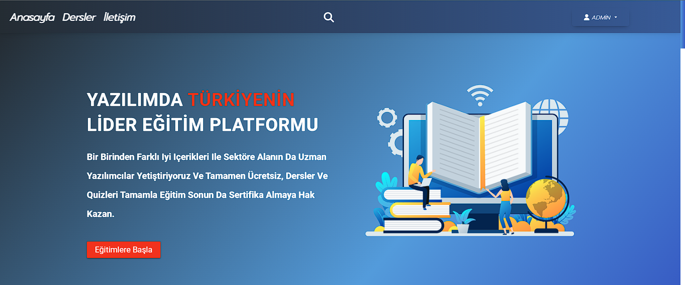
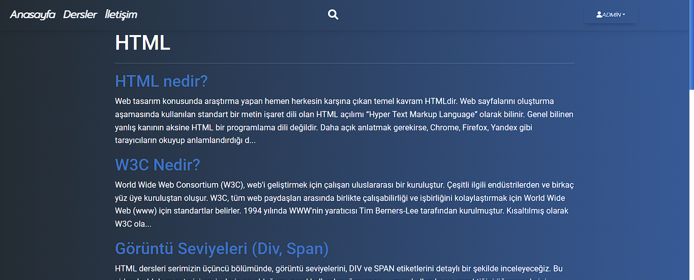
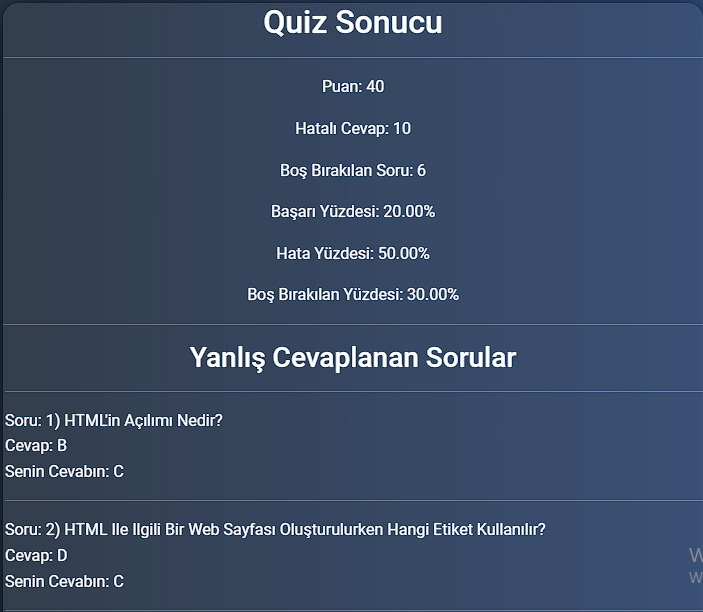

<h1>Quiz Uygulaması</h1>  
Katkıda bulunmak için projeyi forklayın daha sonra yeni branş açarak pull requestlerinizi dahil edin.  
Pull request atarken dbsqlite3 ve migration dosyalarınızı dahil etmeyin.  
dbsqlite ve migration dosyalarınız sizin local dosyalarınızdır projede yapılan değişiklikleri uygulamak / test etmek için kendi local databasenizi güncellemeniz gerekir.  
<b> <h2>Eğer no such column hatası alıyorsanız </h2></b>  

Terminali açıp: <ins>py manage.py makemigrations</ins> daha sonra <ins>py manage.py migrate</ins> komutlarını kullanarak databaseyi güncellemeniz gerekmektedir.

<b> <h2>Projeyi çalıştırmak için gereksinimler</h2></b>  

Aşsağıdaki kütüphaneyi kurmanız gerekmektedir:

pip install django-embed-video

 
<strong>Not: Projenizi güncellerken localde olan veritabanınızı mutlaka saklayın..</strong>
   

